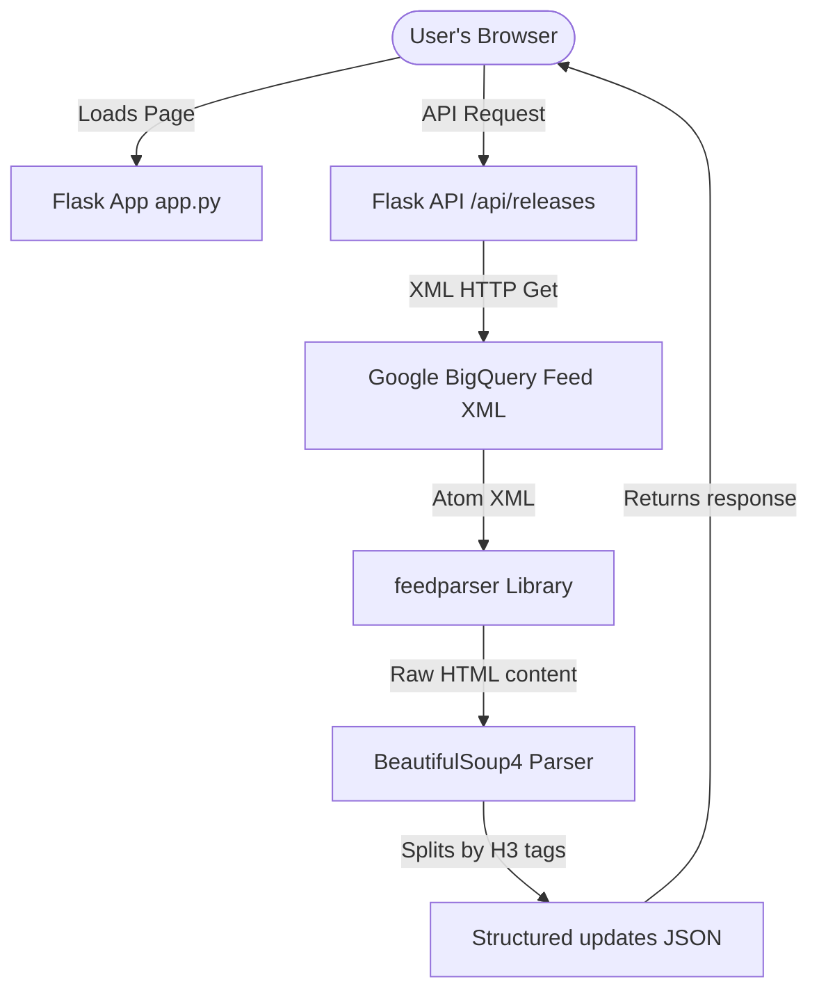

# 🛰️ BigQuery Release Notes Radar

A premium, real-time analytics dashboard tracking Google Cloud BigQuery release notes. Built using a **Python Flask** backend and a custom, responsive **Vanilla HTML/CSS/JS** frontend.

This application fetches BigQuery's official Atom XML feed, parses the contents into discrete, filterable release events, and provides native multi-selection tools to compile and share summaries directly to X (Twitter).

---

## ⚡ Key Features

- **📊 Intelligent Feed Slicer**: Traverses Google's release summaries and extracts individual update items categorized by type (`Feature`, `Issue`, `Change`, `Deprecated`, `Update`).
- **🌓 Adaptive Light/Dark Theme**: Fluid theme toggle switch in the header that overrides CSS root variables, fades ambient glows, and saves selections in local storage.
- **🎨 Glassmorphic UI**: High-tech responsive dashboard styling featuring custom category badges, glowing selection check outlines, and sync status heartbeat animations.
- **🔍 Advanced Filtering**: Search feed notes instantly by keywords and toggle specific categories with real-time stats count updates.
- **📋 Copy to Clipboard**: Instantly copy formatted update summaries, types, dates, and documentation URLs directly from individual card headers, with a visual checkmark feedback state.
- **📥 Filtered CSV Export**: Download currently searched and filtered release updates as an Excel-compatible, BOM-prefixed CSV file stamped with the current date.
- **✉️ Custom Tweet Composer**: Multi-select cards to automatically compile a combined summary tweet fitting within the 280-character limit, featuring a simulated compose modal with character counter and a radial progress ring.
- **⚡ Client-Side Web Intent**: Bridges composed summaries straight to `x.com` without requiring developer API credentials or sign-in overhead.
- **🌀 Caching Engine**: Implements a thread-safe in-memory cache valid for 10 minutes to bypass redundant feed requests, complete with a manual refresh override button.


---

## 🛠️ Tech Stack

- **Backend**: Python 3.14+, Flask, `feedparser`, `beautifulsoup4`, `requests`
- **Frontend**: Vanilla HTML5, Vanilla CSS3 (custom variables, keyframes, transitions), Vanilla JavaScript (ES6, Fetch API)
- **Aesthetics**: Outfit & Inter Google Fonts, custom SVG iconography

---

## 📐 System Flow



---

## 🚀 Getting Started

### 1. Prerequisites
Make sure Python 3 is installed:
```bash
python3 --version
```

### 2. Installation & Setup
Clone the repository and navigate to the project directory:
```bash
git clone https://github.com/aishwaryasvs/antigravity-event-talks-app.git
cd antigravity-event-talks-app
```

Create a virtual environment and install the required dependencies:
```bash
# Initialize virtual environment
python3 -m venv venv

# Activate virtual environment
source venv/bin/activate

# Install dependencies
pip install -r requirements.txt
```

### 3. Running the Server
Start the Flask application:
```bash
python app.py
```
By default, the server will spin up on **[http://127.0.0.1:5000](http://127.0.0.1:5000)**. Open this address in your browser to view the Radar.

---

## 📝 License
This project is licensed under the MIT License.
